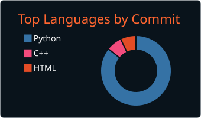
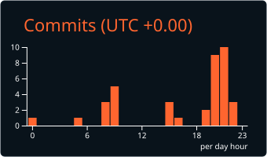

## amiMohammad

[](https://github.com/amiMohammad/Profile_Summary_Cards)
[](https://github.com/amiMohammad/Profile_Summary_Cards) [](https://github.com/amiMohammad/Profile_Summary_Cards)
[](https://github.com/amiMohammad/Profile_Summary_Cards) [](https://github.com/amiMohammad/Profile_Summary_Cards)
### Now you can add this to your markdown
```

[](https://github.com/amiMohammad/Profile_Summary_Cards)
[](https://github.com/amiMohammad/Profile_Summary_Cards) [...]
[](https://github.com/amiMohammad/Profile_Summary_Cards) [
```

    

---


```

```

    

---


```

```

    

---


```

```

    

---


```

```

    